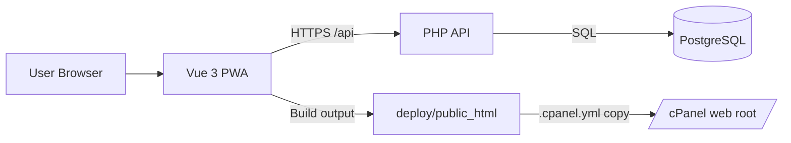

<div align="center">
  
  <h1>OnLedge</h1>
  <p><strong>Camera-first receipt capture, searchable records, and export-ready reporting.</strong></p>
  <p>Built for cPanel shared hosting with a strict local-build, file-copy deployment model.</p>

  <p>
    
    
    
    
  </p>
</div>

---

## Table Of Contents

- [Live Links](#live-links)
- [What OnLedge Does](#what-onledge-does)
- [Product Preview](#product-preview)
- [Architecture](#architecture)
- [Why This Deployment Model](#why-this-deployment-model)
- [Repository Layout](#repository-layout)
- [Quick Start](#quick-start)
- [Configuration](#configuration)
- [Database Setup](#database-setup)
- [Build And Release Workflow](#build-and-release-workflow)
- [cPanel Deployment Runbook](#cpanel-deployment-runbook)
- [Public Repo Guardrails](#public-repo-guardrails)
- [Security Baseline](#security-baseline)
- [Branding And Social Metadata](#branding-and-social-metadata)
- [API Surface (MVP)](#api-surface-mvp)
- [Contributing](#contributing)
- [Compatibility Notes](#compatibility-notes)

## Live Links

- Production app: `https://onledge.gops.app`
- Repository: `git@github.com:agillhock7/OnLedge.git`

## What OnLedge Does

- Capture receipts directly from camera
- Queue and sync intelligently with offline-aware frontend behavior
- Store records in PostgreSQL with full-text search support
- Apply explainable rules during processing
- Export receipts to CSV for reporting/accounting workflows

## Product Preview


## Architecture



## Why This Deployment Model

OnLedge targets shared hosting where server-side Node builds are unreliable or unavailable.

- Build frontend locally
- Assemble runtime API files locally
- Commit deploy artifacts
- Let cPanel copy files into web root

Hard rule: the server should never need `npm`, `vite`, or Node build steps.

## Repository Layout

```txt
/
  .cpanel.yml
  README.md
  SECURITY.md
  .gitignore
  package.json
  /scripts
    prepare-deploy.sh
    generate-social-card.mjs
  /frontend
    /public
      icon.svg
      social-card.png
  /api
    /.htaccess
    /.env.example
    /config
      config.example.php
      (config.php is local/server only, never committed)
    /migrations
      001_init.sql
    /public
      index.php
    /src
  /deploy/public_html
    (committed deploy-ready artifacts)
```

## Quick Start

Prerequisites:

- Node.js 20+
- npm
- PHP 8.x
- PostgreSQL 10+

Install dependencies:

```bash
npm --prefix frontend install
```

Start frontend dev server:

```bash
npm run dev
```

Start local API server:

```bash
php -S 127.0.0.1:8080 -t api/public
```

Optional local API override (`frontend/.env.local`):

```bash
VITE_API_BASE_URL=http://127.0.0.1:8080
```

## Configuration

Create runtime config:

```bash
cp api/config/config.example.php api/config/config.php
```

Required production settings in `api/config/config.php`:

- `app.env = 'production'`
- `app.debug_errors = false`
- `app.url`, `app.api_base_url`
- DB connection (`host`, `port`, `dbname`, `user`, `password`, `sslmode`)
- upload constraints (`uploads.dir`, `max_upload_mb`, `allowed_mime_types`)
- secure session cookies (`secure`, `httponly`, `samesite`)

Reference key map: `api/.env.example`

## Database Setup

Run migration:

```bash
psql "host=<HOST> port=<PORT> dbname=<DB> user=<USER> sslmode=<SSLMODE>" -f api/migrations/001_init.sql
```

Migration includes:

- `users`, `password_resets`, `receipts`, `rules`
- full-text search (`tsvector` + GIN index)
- update triggers
- extension-free UUID generation (`onledge_uuid_v4`) for shared hosts without `pgcrypto`

## Build And Release Workflow

Build locally and generate deploy artifacts:

```bash
npm run build
```

What `npm run build` does:

1. Builds frontend into `deploy/public_html`
2. Recreates hardened uploads folder
3. Copies API runtime into `deploy/public_html/api`

Excluded from deploy artifacts by design:

- `api/config/config.php`
- `api/migrations/`

## cPanel Deployment Runbook

Target paths:

- cPanel Git working tree: `/home/gopsapp1/repositories/onledge`
- Apache/LiteSpeed web root: `/home/gopsapp1/onledge.gops.app`

Release sequence:

1. `npm run build`
2. `git add -A`
3. `git commit -m "<release message>"`
4. `git push origin main`
5. Trigger cPanel deployment (or use auto-deploy)

`.cpanel.yml` handles folder creation + file copy from `deploy/public_html`.

## Public Repo Guardrails

This is a public repository. Treat all commits as publicly visible forever.

Never commit:

- `api/config/config.php`
- any real credentials (DB, SMTP, API tokens)
- user-uploaded receipt files
- server-local paths that include secrets

Pre-push checklist:

1. `git status` contains no secret-bearing files.
2. `deploy/public_html` contains no runtime secrets.
3. Production secrets exist only on server.

## Security Baseline

- Password hashing with `password_hash()`
- User-scoped data access by `user_id`
- Secure session cookie support (`secure`, `httponly`, `samesite`)
- API hardening headers and no-store cache policy
- Mutating API calls require `X-OnLedge-Client: web`
- `.htaccess` blocks direct access to API internals (`config`, `migrations`, `src`)

Security policy and disclosure guidance: see [SECURITY.md](SECURITY.md)

## Branding And Social Metadata

Brand assets:

- Logo icon: `frontend/public/icon.svg`
- Social card: `frontend/public/social-card.png` (`1200x630`)

Metadata configured in `frontend/index.html`:

- Open Graph (`og:*`)
- Twitter cards (`twitter:*`)
- canonical URL
- JSON-LD (`WebApplication`)

Regenerate social card when needed:

```bash
node scripts/generate-social-card.mjs
npm run build
```

## API Surface (MVP)

Auth:

- `POST /api/auth/register`
- `POST /api/auth/login`
- `POST /api/auth/logout`
- `POST /api/auth/forgot-password`
- `GET /api/auth/me`

Receipts:

- `GET /api/receipts`
- `POST /api/receipts`
- `GET /api/receipts/{id}`
- `PUT /api/receipts/{id}`
- `DELETE /api/receipts/{id}`
- `POST /api/receipts/{id}/process`

Rules / Search / Export:

- `GET /api/rules`
- `POST /api/rules`
- `PUT /api/rules/{id}`
- `DELETE /api/rules/{id}`
- `GET /api/search?q=...`
- `GET /api/export/csv?from=YYYY-MM-DD&to=YYYY-MM-DD`

## Contributing

- Keep changes scoped and reviewable.
- Preserve local-build -> committed-artifacts deployment flow.
- Update `deploy/public_html` whenever runtime frontend/API output changes.
- Prefer secure defaults and document behavioral changes.

Recommended checks before PR:

```bash
npm --prefix frontend run typecheck
npm run build
```

## Compatibility Notes

Target hosting profile:

- cPanel `132.0 (build 24)`
- Apache `2.4.66` (LiteSpeed-compatible request handling)
- Linux `x86_64`
- PHP `8.x`
- PostgreSQL `10+`
