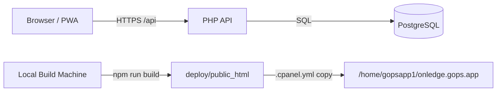

<div align="center">
  
  <h1>OnLedge</h1>
  <p><strong>Capture receipts fast, keep records clean, and export with confidence.</strong></p>
  <p>Built for cPanel shared hosting where deployment is file-copy only.</p>

  <p>
    
    
    
    
  </p>
</div>

---

## Table Of Contents

- [Live Project](#live-project)
- [What OnLedge Includes](#what-onledge-includes)
- [Hosting Model (Important)](#hosting-model-important)
- [Architecture](#architecture)
- [Repository Layout](#repository-layout)
- [Quick Start (Local)](#quick-start-local)
- [Configuration](#configuration)
- [Database Setup](#database-setup)
- [Database Permissions (Required)](#database-permissions-required)
- [Admin Bootstrap (Seed Owner)](#admin-bootstrap-seed-owner)
- [OAuth Setup (GitHub + Discord)](#oauth-setup-github--discord)
- [Email Notifications](#email-notifications)
- [Build And Release](#build-and-release)
- [cPanel Deployment](#cpanel-deployment)
- [Cron Job (Weekly Reports)](#cron-job-weekly-reports)
- [Security Checklist](#security-checklist)
- [API Surface](#api-surface)
- [Troubleshooting](#troubleshooting)
- [Contributing](#contributing)
- [License](#license)
- [Compatibility Notes](#compatibility-notes)

## Live Project

- Production app: `https://onledge.gops.app`
- Repository: `git@github.com:agillhock7/OnLedge.git`

## What OnLedge Includes

- Camera-first receipt capture flow with mobile-friendly UX
- Manual edge adjustment before upload for cleaner extraction
- AI-assisted extraction (vendor, totals, dates, taxes, line items, etc.)
- Receipt profile editing with full detail correction workflow
- Searchable receipt command center
- Reporting dashboard with trend visualizations and AI review
- Rules engine with no-code GUI and explainability traces
- Role-based access (`user`, `admin`, `owner`)
- Threaded support ticket workspace
- Welcome + weekly report emails, plus in-app "Send Test Email"
- Offline-aware frontend queue with sync-on-reconnect

## Hosting Model (Important)

This repo is intentionally designed for shared hosting constraints.

Hard rule:
- The server must never need `npm`, `vite`, or Node build steps.

Deployment model:
1. Build locally.
2. Assemble deploy artifacts into `deploy/public_html`.
3. Commit artifacts.
4. Let cPanel Git deployment copy files into web root.

## Architecture



## Repository Layout

```txt
/
  .cpanel.yml
  README.md
  SECURITY.md
  .gitignore
  package.json
  /scripts
    prepare-deploy.sh
    create-seed-owner.php
    run-weekly-report-cron.php
    generate-social-card.mjs
  /frontend
    /public
      icon.svg
      social-card.png
  /api
    /.htaccess
    /.env.example
    /config
      config.example.php
      (config.php is local/server only, never committed)
    /migrations
      001_init.sql
      002_admin_support.sql
      004_oauth_identities.sql
      005_receipt_ai_fields.sql
      006_support_threads.sql
      007_user_notifications.sql
    /public
      index.php
    /src
  /deploy/public_html
    (committed deploy artifacts)
```

## Quick Start (Local)

Prerequisites:
- Node.js 20+
- npm
- PHP 8.x
- PostgreSQL 10+

Install frontend dependencies:

```bash
npm --prefix frontend install
```

Run frontend:

```bash
npm run dev
```

Run API locally:

```bash
php -S 127.0.0.1:8080 -t api/public
```

Optional frontend API override (`frontend/.env.local`):

```bash
VITE_API_BASE_URL=http://127.0.0.1:8080
```

## Configuration

Create runtime config:

```bash
cp api/config/config.example.php api/config/config.php
```

`api/config/config.php` is required at runtime and must never be committed.

Required values to set:
- `app.env`, `app.url`, `app.api_base_url`
- `database.host`, `port`, `dbname`, `user`, `password`, `sslmode`
- `uploads.dir`, `uploads.max_upload_mb`, `uploads.allowed_mime_types`
- `session_cookie.secure`, `httponly`, `samesite`

Optional sections:
- `ai` for receipt extraction and report review
- `oauth` for GitHub/Discord login
- `smtp` for enabling email notifications (transport uses PHP `mail()` / server sendmail)

Reference map for env-style keys:
- `api/.env.example`

## Database Setup

Run migrations in order:

```bash
psql "host=<HOST> port=<PORT> dbname=<DB> user=<USER> sslmode=<SSLMODE>" -f api/migrations/001_init.sql
psql "host=<HOST> port=<PORT> dbname=<DB> user=<USER> sslmode=<SSLMODE>" -f api/migrations/002_admin_support.sql
psql "host=<HOST> port=<PORT> dbname=<DB> user=<USER> sslmode=<SSLMODE>" -f api/migrations/004_oauth_identities.sql
psql "host=<HOST> port=<PORT> dbname=<DB> user=<USER> sslmode=<SSLMODE>" -f api/migrations/005_receipt_ai_fields.sql
psql "host=<HOST> port=<PORT> dbname=<DB> user=<USER> sslmode=<SSLMODE>" -f api/migrations/006_support_threads.sql
psql "host=<HOST> port=<PORT> dbname=<DB> user=<USER> sslmode=<SSLMODE>" -f api/migrations/007_user_notifications.sql
```

Important PostgreSQL notes for shared hosts:
- `001_init.sql` is PostgreSQL 10 compatible (`EXECUTE PROCEDURE`, not `EXECUTE FUNCTION`).
- UUID generation uses `onledge_uuid_v4()` and does not require `pgcrypto`.
- In pgAdmin query windows, do not use `\i`. Paste SQL file contents directly.

## Database Permissions (Required)

After migrations, grant privileges to your app DB user (example: `gopsapp1_onledgeusr`):

```sql
GRANT USAGE ON SCHEMA public TO gopsapp1_onledgeusr;
GRANT SELECT, INSERT, UPDATE, DELETE ON ALL TABLES IN SCHEMA public TO gopsapp1_onledgeusr;
GRANT USAGE, SELECT ON ALL SEQUENCES IN SCHEMA public TO gopsapp1_onledgeusr;

ALTER DEFAULT PRIVILEGES IN SCHEMA public
  GRANT SELECT, INSERT, UPDATE, DELETE ON TABLES TO gopsapp1_onledgeusr;

ALTER DEFAULT PRIVILEGES IN SCHEMA public
  GRANT USAGE, SELECT ON SEQUENCES TO gopsapp1_onledgeusr;
```

Without these grants, API calls may fail with SQLSTATE `42501` permission errors.

## Admin Bootstrap (Seed Owner)

Create a one-time seed owner quickly:

```bash
php scripts/create-seed-owner.php
```

This prints:
- temporary email
- temporary password
- SQL block to run in your PostgreSQL UI

Recommended flow:
1. Run script.
2. Execute printed SQL.
3. Login with seed owner.
4. Create permanent owner/admin users in Settings.
5. Disable seed account(s).

## OAuth Setup (GitHub + Discord)

Enable providers in `api/config/config.php`:
- `oauth.github.enabled = true`
- `oauth.discord.enabled = true`

Set client credentials and exact callback URLs:
- GitHub callback: `https://onledge.gops.app/api/auth/oauth/github/callback`
- Discord callback: `https://onledge.gops.app/api/auth/oauth/discord/callback`

Run migration `004_oauth_identities.sql` before using social login.

## Email Notifications

Email templates live in `api/src/Templates/Email/`.

Current templates:
- support ticket created/replied/updated
- welcome email
- weekly spending report
- test notification

Enable notifications in `api/config/config.php`:

```php
'smtp' => [
  'enabled' => true,
  'from_email' => 'records@onledge.gops.app',
  'from_name' => 'OnLedge',
  'reply_to' => 'support@onledge.gops.app',
],
```

Note:
- Sending uses PHP `mail()` / server sendmail.
- `smtp.enabled` is the on/off gate.
- Host/port/user/password fields are metadata placeholders unless your server mail stack is configured to use them.

## Build And Release

Build deploy artifacts locally:

```bash
npm run build
```

What this does:
1. Builds frontend with Vite directly into `deploy/public_html`.
2. Rebuilds hardened `deploy/public_html/uploads` files.
3. Copies API runtime files into `deploy/public_html/api`.

Never deploy from unbuilt source.

Release flow:

```bash
npm run build
git add -A
git commit -m "<release message>"
git push origin main
```

## cPanel Deployment

`.cpanel.yml` runs on cPanel deploy and copies artifacts to web root:

```yaml
deployment:
  tasks:
    - export DEPLOYPATH=/home/gopsapp1/onledge.gops.app/
    - /bin/mkdir -p $DEPLOYPATH
    - /bin/mkdir -p $DEPLOYPATH/uploads
    - /bin/mkdir -p $DEPLOYPATH/api
    - /bin/chmod 775 $DEPLOYPATH/uploads
    - /bin/cp -R deploy/public_html/. $DEPLOYPATH
```

Deployment targets:
- cPanel Git working tree: `/home/gopsapp1/repositories/onledge` (or `OnLedge` depending on server-side clone name)
- Web root: `/home/gopsapp1/onledge.gops.app`

## Cron Job (Weekly Reports)

Set a cPanel cron command:

```bash
/usr/bin/php /home/gopsapp1/repositories/OnLedge/scripts/run-weekly-report-cron.php >> /home/gopsapp1/logs/onledge-weekly-cron.log 2>&1
```

Recommended schedule:
- Weekly Monday morning, or
- Daily (script self-limits to once every 7 days per user)

## Security Checklist

Public repo guardrails:
- Never commit `api/config/config.php`.
- Never commit real DB/API/SMTP credentials.
- Never commit uploaded receipt files.
- Keep deploy artifacts secret-free.

Application baseline:
- Passwords hashed via `password_hash()`.
- User data scoped by `user_id`.
- Secure session cookies (`secure`, `httponly`, `samesite`).
- API security headers + mutating request guard (`X-OnLedge-Client: web`).
- API internals protected by `.htaccess`.
- File preview endpoint is same-origin-only for secure inline rendering.

For vulnerability disclosure process, see [SECURITY.md](SECURITY.md).

## API Surface

Auth:
- `POST /api/auth/register`
- `POST /api/auth/login`
- `POST /api/auth/logout`
- `POST /api/auth/forgot-password`
- `GET /api/auth/me`
- `GET /api/auth/oauth/providers`
- `GET /api/auth/oauth/github/start`
- `GET /api/auth/oauth/github/callback`
- `GET /api/auth/oauth/discord/start`
- `GET /api/auth/oauth/discord/callback`

Receipts:
- `GET /api/receipts`
- `POST /api/receipts`
- `GET /api/receipts/{id}`
- `GET /api/receipts/{id}/image`
- `PUT /api/receipts/{id}`
- `DELETE /api/receipts/{id}`
- `POST /api/receipts/{id}/process`

Rules / Search / Export / Reports:
- `GET /api/rules`
- `POST /api/rules`
- `PUT /api/rules/{id}`
- `DELETE /api/rules/{id}`
- `GET /api/search?q=...`
- `GET /api/export/csv?from=YYYY-MM-DD&to=YYYY-MM-DD`
- `GET /api/reports/overview?from=YYYY-MM-DD&to=YYYY-MM-DD`
- `POST /api/reports/ai-review`

Notifications:
- `GET /api/notifications/preferences`
- `PUT /api/notifications/preferences`
- `POST /api/notifications/test-email`

Support:
- `POST /api/support/tickets`
- `GET /api/support/tickets/my`
- `GET /api/support/tickets/{id}`
- `POST /api/support/tickets/{id}/messages`

Admin:
- `GET /api/admin/users`
- `POST /api/admin/users`
- `PUT /api/admin/users/{id}`
- `GET /api/admin/tickets`
- `PUT /api/admin/tickets/{id}`

## Troubleshooting

### `500` with DB permission errors (`SQLSTATE 42501`)

Grant table/sequence privileges to the app DB user. See [Database Permissions (Required)](#database-permissions-required).

### `syntax error at or near "FUNCTION"` in trigger creation

You are on PostgreSQL 10 behavior. Use migration files from this repo (they use `EXECUTE PROCEDURE`).

### `could not open extension control file ... pgcrypto.control`

Do not install `pgcrypto` on shared hosts that block extensions. This project uses `onledge_uuid_v4()` instead.

### pgAdmin rejects `\i`

`\i` is a `psql` shell command, not SQL. Paste migration content directly in pgAdmin query window.

### PDF preview blocked with `frame-ancestors 'none'`

Fixed in current versions by scoped same-origin header override on `/api/receipts/{id}/image`. Pull latest and redeploy.

### Social login opens blank page

Confirm:
- `oauth.<provider>.enabled = true`
- correct callback URL in provider console and `config.php`
- migration `004_oauth_identities.sql` is applied

### Seed login fails

Recreate a fresh seed using `php scripts/create-seed-owner.php`, run emitted SQL, then login with printed credentials.

## Contributing

Standards for PRs:
- Keep changes scoped and reviewable.
- Preserve local-build -> committed-artifacts deployment model.
- Update `deploy/public_html` when runtime frontend/API output changes.
- Maintain secure defaults and document behavior changes.

Recommended checks before pushing:

```bash
npm --prefix frontend run typecheck
npm run build
```

## License

This project is licensed under the MIT License. See [LICENSE](LICENSE).

## Compatibility Notes

Target hosting profile:
- cPanel `132.x`
- Apache/LiteSpeed-compatible environment
- Linux `x86_64`
- PHP `8.x`
- PostgreSQL `10+`

---


